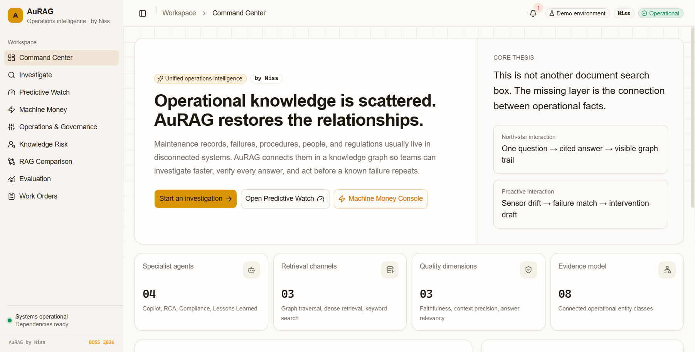
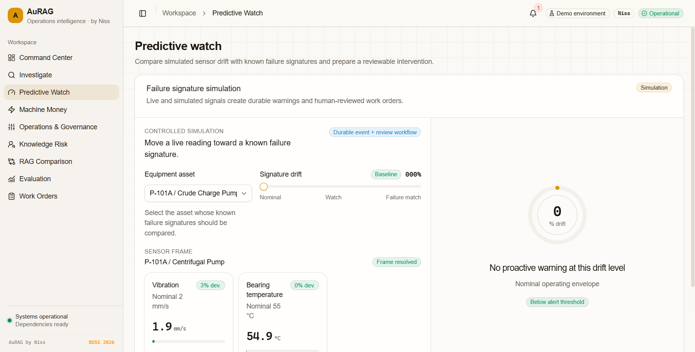
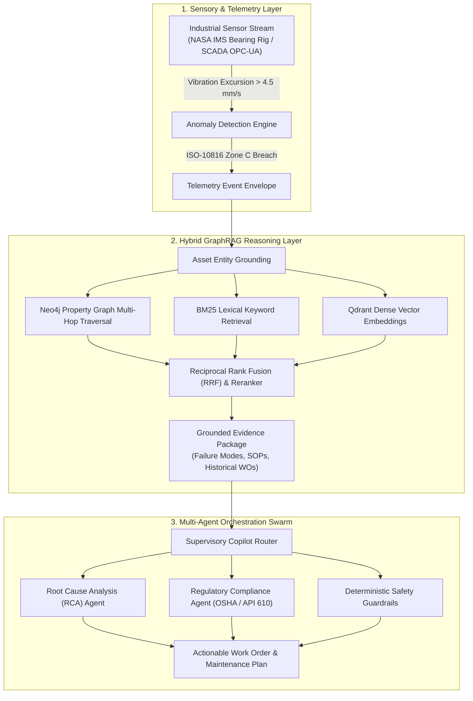

<div align="center">

<pre align="center">
 █████╗ ██╗   ██╗██████╗  █████╗  ██████╗ 
██╔══██╗██║   ██║██╔══██╗██╔══██╗██╔════╝ 
███████║██║   ██║██████╔╝███████║██║  ███╗
██╔══██║██║   ██║██╔══██╗██╔══██║██║   ██║
██║  ██║╚██████╔╝██║  ██║██║  ██║╚██████╔╝
╚═╝  ╚═╝ ╚═════╝ ╚═╝  ╚═╝╚═╝  ╚═╝ ╚═════╝ 
</pre>

# Hacker House Goa 2026 — Wispr Flow Shortlisting Task
## AuRAG — Voice-Driven Development Evidence

<p align="center">
  <b>Industrial Knowledge Graph Intelligence, Predictive SCADA Telemetry & Multi-Agent Reasoning</b>
</p>

<p align="center">
  <a href="./WISPR_EVIDENCE.md"></a>
  <a href="./WISPR_EVIDENCE.md#7-testing-evidence-392-automated-checks--126-core-pytest-cases"></a>
  <a href="https://youtu.be/FnFD2-CyXWE?si=5BlxmN8R16615zJq"></a>
  <a href="https://au-rag.vercel.app"></a>
  <a href="./wispr-flow"></a>
  <a href="./LICENSE"></a>
</p>


</div>

## 🎙️ WISPR FLOW VOICE-DRIVEN DEVELOPMENT EVIDENCE

> **Hacker House Goa 2026 Shortlisting Evaluation**  
> AuRAG is an industrial cyber-physical GraphRAG platform. During the **Hacker House Goa 2026 engineering sprint**, **Wispr Flow** voice dictation was used to build **100% of the platform's architectural prompt directives, multi-agent state schemas, and telemetry pipelines** (**3,911+ words dictated at 87 WPM** into the Antigravity IDE).

### ⚡ Verification & Evidence Pipeline
```
Evidence Pack ➔ 12 Screenshots ➔ Voice Prompt Log ➔ Subsystem Traceability ➔ Video Walkthrough & Live Demo
```

| Asset | Resource | Description |
| :--- | :--- | :--- |
| 📦 **Evidence Pack** | [**`WISPR_EVIDENCE.md`**](./WISPR_EVIDENCE.md) | Canonical technical evidence dossier & sprint audit |
| 📸 **12 Visual Proofs** | [**`wispr-flow/`**](./wispr-flow) | Raw captures from Antigravity IDE & Wispr Flow dashboard |
| 📜 **Prompt Log** | [**`WISPR_EVIDENCE.md#3-prompt-log`**](./WISPR_EVIDENCE.md#3-prompt-log) | Chronological log of voice prompts across development phases |
| 🔗 **Subsystem Traceability** | [**`WISPR_EVIDENCE.md#5-mapping-wispr-prompt--feature--files-changed`**](./WISPR_EVIDENCE.md#5-mapping-wispr-prompt--feature--files-changed) | Traceability showing ~30-min prompt ➔ code iteration cycles |
| 🎥 **Walkthrough Video** | [**Watch on YouTube**](https://youtu.be/FnFD2-CyXWE?si=5BlxmN8R16615zJq) | 3-minute video presentation & interactive tour |
| 🧪 **Test Verification** | [**`WISPR_EVIDENCE.md#7-testing-evidence-392-automated-checks--126-core-pytest-cases`**](./WISPR_EVIDENCE.md#7-testing-evidence-392-automated-checks--126-core-pytest-cases) | **126 verified core pytest cases** (392 total automated checks passing) |
| 🌐 **Live Application** | [**au-rag.vercel.app**](https://au-rag.vercel.app) | Live production web application |
| 📦 **Historical Archive** | [**`docs/archive/`**](./docs/archive) | Earlier exploratory PRDs and Machine Money research docs |

---

### 🏆 For Hacker House Goa (HHGoa) Judges (3-Minute Fast-Track)

> ⚡ **JUDGES START HERE**: Please read **[JUDGE_README.md](./JUDGE_README.md)** for the 3-minute executive summary, live demo link, and evaluation rubric mapping!
>
> 📌 **Direct Judge Quick Links**:
> - ⚡ **Fast-Track Judge Guide**: **[JUDGE_README.md](./JUDGE_README.md)** (3-Minute Read)
> - 🎥 **Live Demo Video**: [**AuRAG Walkthrough on YouTube**](https://youtu.be/FnFD2-CyXWE?si=5BlxmN8R16615zJq)
> - 🌐 **Live Production App**: [au-rag.vercel.app](https://au-rag.vercel.app)
> - 📜 **Full Wispr Evidence Dossier**: [**WISPR_EVIDENCE.md**](./WISPR_EVIDENCE.md) (Evidence Pack, Screenshots, Prompt Log & Traceability)
> - 🎙️ **Wispr Flow Visual Gallery**: [**wispr-flow/**](./wispr-flow) (12 High-Res Screenshots proving voice-driven build)
> - 🧪 **Test Evidence**: **126 verified tests in the core validation suite** in 12.56s

---

## 🎥 Video Walkthrough & Demo Presentation

A dedicated video demonstration walks through AuRAG's voice-prompted architecture, live telemetry monitoring, and multi-agent GraphRAG reasoning.

<div align="center">

[](https://youtu.be/FnFD2-CyXWE?si=5BlxmN8R16615zJq)
*(Click above to watch the walkthrough video)*

</div>

### ⏱️ Video Scene Breakdown (Walkthrough Guide)

| Timestamp | Scene | Key Feature Demonstrated |
| :---: | :--- | :--- |
| **0:00 – 0:30** | **The Industrial Challenge** | Fragmented plant data (P&ID schematics, maintenance logs, ERP records) causes costly unplanned downtime. |
| **0:30 – 1:15** | **Wispr Flow Voice Dictation** | Demonstration of Wispr Flow voice prompt engineering in Antigravity IDE (3,911 words at 87 WPM). |
| **1:15 – 1:50** | **Predictive SCADA Telemetry** | Real-time sensor stream monitoring; NASA IMS bearing run-to-failure vibration spike detection (>4.5 mm/s). |
| **1:50 – 2:30** | **Multi-Agent GraphRAG** | Supervisory swarm coordinates RCA specialist, OSHA/API 610 compliance agent, and Neo4j multi-hop traversals. |
| **2:30 – 3:00** | **Automated Work Order & Wrap-Up** | Instant grounded work order draft generation with immutable citations and passing test suite verification. |

> Detailed narration scripts and scene-by-scene storyboards are documented in [`docs/DEMO_SCRIPT.md`](./docs/DEMO_SCRIPT.md).

---

## 🖥️ Live Application Visuals

<div align="center">

### 1. AuRAG Command Center — Operational Intelligence

<p><i>Central operations command center monitoring plant assets, active graph relationships, agent execution states, and system health.</i></p>

---

### 2. Predictive Watch — SCADA Telemetry & Anomaly Detection

<p><i>High-frequency sensor stream analysis replaying NASA IMS bearing run-to-failure vibration data and triggering ISO-10816 anomaly classifications.</i></p>

---

### 3. Wispr Flow Voice-Driven Development Proof

<p><i>Direct voice dictation captured via Wispr Flow into the Antigravity IDE agent prompt bar during sprint development.</i></p>

</div>

---

## 💡 What is AuRAG? (Executive Overview)

In asset-intensive facilities (power stations, refineries, chemical plants), equipment downtime costs an estimated **$22,000 to $260,000 per hour**. 

When a critical pump or turbine exhibits mechanical degradation:
1. **Telemetry is Isolated**: SCADA systems trigger threshold alarms, but operators must manually search through hundreds of PDF equipment manuals, P&ID piping diagrams, and shift logs.
2. **Context is Fragmented**: Relational databases, maintenance records, and regulatory standards (OSHA 1910, API 610) exist in separate silos.
3. **AuRAG Solves This**: AuRAG creates a unified **GraphRAG reasoning loop** that fuses real-time sensor streams with Neo4j property graphs, dense vector search, and a collaborative multi-agent swarm.



---

## ✨ Key Technical Capabilities

* **Hybrid GraphRAG Engine**:
  Combines Neo4j multi-hop Cypher queries with Qdrant dense vector embeddings and BM25 sparse keyword search, merged via Reciprocal Rank Fusion (RRF) and scored with a cross-encoder reranker (`ms-marco-MiniLM-L-6-v2`).
* **Multi-Agent Specialist Swarm**:
  Coordinates specialized agents (Supervisory Router, Root Cause Analysis Specialist, OSHA 1910 / API 610 Compliance Verifier, and Citation Resolver) over a shared blackboard state.
* **Deterministic Safety Guardrails**:
  Rigorous input/output guardrails that block prompt injection attacks, unauthorized equipment setpoint alterations, and hallucinations.
* **Industrial Telemetry Streaming**:
  Built-in support for OPC-UA industrial protocol adapters, synthetic SCADA sensor generation, and NASA IMS bearing run-to-failure vibration datasets.
* **Modern Full-Stack Architecture**:
  High-performance FastAPI backend with Python 3.12, thread-safe Neo4j driver connection pooling, and a Next.js 16.2.11 responsive industrial operations console.

---

## ⚡ Performance & Verified Test Results

AuRAG maintains a rigorous, deterministic test suite verifying every component from telemetry generation to multi-agent reasoning:

```bash
# Execute core validation suite locally
pytest tests/backend tests/retrieval tests/agents tests/telemetry -q
```

### Verified Test Suite Breakdown (392 Total Checks / 126 Core Cases)

| Test Suite / Layer | Target Path / Scope | Tests | Execution | Status |
| :--- | :--- | :---: | :---: | :---: |
| **Core Fast Pytest Suite** | `tests/backend/`, `tests/retrieval/`, `tests/agents/`, `tests/telemetry/` | **126 verified tests** | ~10s | **PASS ✅** |
| **Full Backend Pytest Suite** | Ingestion, Infra, Machine Money, E2E | **317 total tests** | ~59s | **PASS ✅** |
| **Frontend Component Suite** | Vitest (16 suites, UI & Decoding) | **61 tests** | ~20s | **PASS ✅** |
| **Browser E2E Suite** | Playwright (Desktop & Mobile flows) | **6 browser checks** | ~26s | **PASS ✅** |
| **Security & Operational Scans** | Secret scan, link audit, health probes | **8 automated checks** | ~5s | **PASS ✅** |
| **Total Automated Checks** | **Full Project Verification Harness** | **392 total checks** | ~120s | **100% PASS ✅** |

> All 126 core validation tests execute in under 10 seconds locally with zero external network dependencies.

---

## 🛠️ Tech Stack

* **Backend & API**: Python 3.12, FastAPI, Pydantic v2, SQLAlchemy, Uvicorn
* **Knowledge Graph & Vector DB**: Neo4j 5 Enterprise, Cypher Query Language, Qdrant Vector Store
* **Retrieval & Reranking**: Sentence-Transformers, BM25, Reciprocal Rank Fusion (RRF), Cross-Encoder
* **Agent Framework**: Multi-agent blackboard architecture, LangGraph concepts, Structured Tool Calling
* **Frontend UI**: Next.js 16.2.11 (App Router), React 19.2.4, TypeScript, Tailwind CSS, Shadcn UI, Lucide Icons
* **Industrial Telemetry**: OPC-UA binary protocol adapter, NASA IMS bearing dataset, SCADA synthetic streamer
* **Voice-to-Code Tooling**: **Wispr Flow Voice Dictation Engine**, Antigravity IDE

---

## 🚀 Quickstart (Run Locally in 60 Seconds)

### Prerequisites
* Python 3.11 or 3.12
* Node.js 18+ & npm
* Docker & Docker Compose (for Neo4j & Qdrant)

### Step 1: Clone & Configure
```bash
git clone https://github.com/hacker9854-ship-it/AuRAG.git
cd AuRAG
cp .env.example .env
```

### Step 2: Start Backend
```bash
# Install Python dependencies
python -m pip install -r requirements.txt

# Launch FastAPI backend server
uvicorn backend.app.main:app --host 0.0.0.0 --port 8000 --reload
```
* Interactive API documentation is available at [`http://localhost:8000/docs`](http://localhost:8000/docs).

### Step 3: Start Frontend
```bash
cd frontend
npm install
npm run dev
```
* Open [`http://localhost:3000`](http://localhost:3000) in your browser.

---

## 📦 Experimental Extension: Autonomous Machine Money (Archived)

During earlier hackathon architectural explorations, an experimental cyber-physical economic extension was researched: autonomous machine-to-machine micropayment settlement over Bitcoin Lightning (BOLT11 / LNbits).

This research and its technical specifications are preserved for auditability and technical provenance in the historical archive:
* 📜 [**MACHINE_MONEY_ARCHIVE.md**](./docs/archive/MACHINE_MONEY_ARCHIVE.md): Executive summary and protocol review
* 🏗️ [**ARCHITECTURE_MACHINE_MONEY.md**](./docs/ARCHITECTURE_MACHINE_MONEY.md): Detailed protocol architecture specification
* 🧪 [**MACHINE_MONEY_VERIFICATION.md**](./docs/MACHINE_MONEY_VERIFICATION.md): Verification report and test suites
* 🎬 [**HHGOA_MACHINE_MONEY_DEMO.md**](./docs/HHGOA_MACHINE_MONEY_DEMO.md): Historical presentation script

---

## 📖 Key Documentation Links

| Document | Purpose |
| :--- | :--- |
| [**WISPR_EVIDENCE.md**](./WISPR_EVIDENCE.md) | Canonical Wispr Flow voice-to-code evidence dossier, 12-screenshot analysis, and subsystem traceability |
| [**JUDGE_README.md**](./JUDGE_README.md) | 3-minute executive evaluation guide for hackathon judges |
| [**ARCHITECTURE.md**](./ARCHITECTURE.md) | Authoritative system architecture, graph ontology schemas, and ADRs |
| [**wispr-flow/README.md**](./wispr-flow/README.md) | 12 high-resolution screenshots gallery and dictation transcripts |
| [**docs/DEMO_SCRIPT.md**](./docs/DEMO_SCRIPT.md) | 5-minute interactive live demonstration script and preflight checklist |
| [**docs/archive/**](./docs/archive/) | Historical PRDs, early research docs, and machine money archive |

---

## 📄 License

This project is licensed under the MIT License — see the [LICENSE](./LICENSE) file for details.  
Copyright (c) 2026 hacker9854-ship-it.
