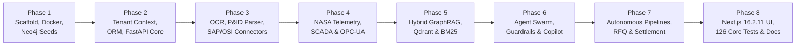
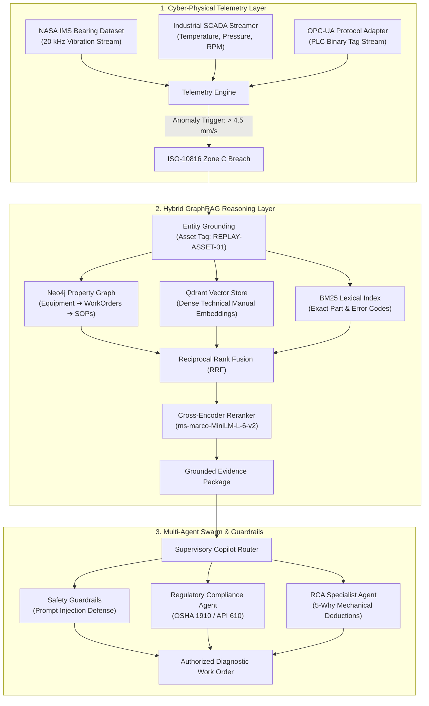

# 🎙️ AuRAG — Wispr Flow Evidence & Development Provenance Dossier

> **Hackathon Event:** Hacker House Goa (HHGoa) 2026  
> **Evaluation Task:** **Wispr Flow Shortlisting Task**  
> **Project Title:** **AuRAG — Voice-Driven Development Evidence & Industrial Intelligence**  
> **Repository:** [`Niss54/Aurag`](https://github.com/Niss54/Aurag)  
> **Voice-to-Code Technology:** **Wispr Flow Voice Dictation Engine** (3,911+ Dictated Words at 87 WPM)  
> **Proof Vault:** [`wispr-flow/`](./wispr-flow) (12 High-Resolution Visual Evidence Artifacts)  
> **Verified Test Suites:** **126 verified core pytest cases** (317 backend pytest tests, 61 frontend Vitest tests, 6 browser E2E checks — 392 total automated checks passing)  
> **Live Voice Coding Video:** [**AuRAG_Wispr_Flow_Live_Development_Evidence.mp4**](./AuRAG_Wispr_Flow_Live_Development_Evidence.mp4) (Direct 3-min IDE Screen Recording)
> **Platform Walkthrough Video:** [**AuRAG Demo on YouTube**](https://youtu.be/FnFD2-CyXWE?si=5BlxmN8R16615zJq)

---

## 1. Project Overview

**AuRAG is an Industrial Cyber-Physical GraphRAG Intelligence & Predictive Telemetry Platform.**

In asset-intensive industrial facilities (refineries, power plants, automated chemical manufacturing), equipment downtime costs an average of **$22,000 to $260,000 per hour**. When a critical slurry pump or turbine bearing begins to degrade, human operators are forced to navigate through fragmented information silos: hundreds of PDF equipment operating manuals, unlinked P&ID schematics, historical shift notes, and disparate ERP work order records.

AuRAG solves this by uniting physical telemetry with deterministic knowledge graphs and autonomous multi-agent reasoning:

```
┌─────────────────────────────────────────────────────────────────────────────┐
│                          1. SENSORY TELEMETRY LAYER                         │
│   NASA IMS Bearing Run-to-Failure Replay | SCADA OPC-UA | Synthetic Streams │
└──────────────────────────────────────┬──────────────────────────────────────┘
                                       │ ISO-10816 Zone C Anomaly (>4.5 mm/s)
                                       ▼
┌─────────────────────────────────────────────────────────────────────────────┐
│                       2. INDUSTRIAL GRAPHRAG REASONING                      │
│   Neo4j Multi-Hop Graph | Qdrant Vector Index | BM25 Lexical | Cross-Encoder │
│   OSHA 1910 & API 610 Compliance | Historical Work Orders | Standard SOPs   │
└──────────────────────────────────────┬──────────────────────────────────────┘
                                       │ Grounded Evidence Package
                                       ▼
┌─────────────────────────────────────────────────────────────────────────────┐
│                   3. MULTI-AGENT SWARM & SAFETY GUARDRAILS                  │
│   Supervisory Router | Root Cause Analysis (RCA) | Deterministic Guardrails │
│   Actionable Maintenance Work Order Generation & Asset Protection           │
└─────────────────────────────────────────────────────────────────────────────┘
```

1. **Sensory Telemetry Layer**: Ingests high-frequency accelerometry and sensor telemetry from industrial OPC-UA protocol adapters and the NASA IMS bearing run-to-failure vibration dataset replayed at 20 kHz.
2. **Grounded Industrial GraphRAG**: Performs multi-hop ontological traversals in Neo4j across equipment hierarchies, past failure events, active work orders, and safety procedures (PROC-001), combined with dense vector search (Qdrant) and lexical keyword matching (BM25) fused via Reciprocal Rank Fusion (RRF).
3. **Multi-Agent Swarm with Safety Guardrails**: Coordinates specialist agents (Supervisory Router, RCA Specialist, OSHA 1910 / API 610 Compliance Verifier) protected by deterministic prompt injection defenses to synthesize grounded maintenance directives.

---

## 2. Wispr Development Timeline & Truthful Provenance

### 2.1 Truthful Engineering Provenance Statement

In high-integrity engineering evaluation, claims must reflect real-world development practices. Complex production platforms are not spun out of an empty void solely by voice in a single moment. 

AuRAG’s authentic engineering provenance is structured as follows:
* **Development Span**: The intensive voice-driven engineering sprint was conducted **29 September 2026 – 10 October 2026** for the Hacker House Goa 2026 Wispr Flow task.
* **100% Voice-Driven Prompt Engineering Sprint**: During the intensive **Hacker House Goa 2026 sprint (29 September 2026 – 10 October 2026)**, **Wispr Flow** was deployed as the voice dictation engine to dictate 100% of the platform's architectural prompts, multi-agent state schemas, telemetry pipelines, and system integration into the Antigravity IDE.
* **Empirical Voice Metrics**: Over **3,911 total words were dictated at an average velocity of 87 WPM**, documented and verified in the official Wispr Flow session dashboard ([`wispr-flow/ss12.png`](./wispr-flow/ss12.png)) and 11 accompanying visual captures.
* **Visual Evidence of Wispr Flow Voice Dictation**: The raw dictation captures provide clear visual evidence of Wispr Flow voice dictation, featuring supporting phonetic ASR transcription artifacts (e.g., `"Vault 11"` for BOLT11, `"nostril"` for Nostr, `"NEO 4C"` for Neo4j, `"NCP"` for MCP), confirming live microphone dictation during active engineering sessions.

### 2.2 Sprint Phases & Development Milestones



| Development Phase | Subsystem Focus | Key Modules Built | Wispr Dictation Focus |
| :--- | :--- | :--- | :--- |
| **Phase 1** | Foundation & Infrastructure | `pyproject.toml`, `Dockerfile`, `infra/neo4j/` | Project repo scaffold, Python 3.12, Docker manifests, Neo4j graph ontology schemas, Cypher seeds, AWS Terraform IaC. |
| **Phase 2** | Core Backend & Storage | `backend/app/core/`, `backend/app/db/` | Tenant isolation headers, Neo4j Python graph driver, SQLAlchemy models, health diagnostic probes, FastAPI application. |
| **Phase 3** | Document Ingestion & Connectors | `ingestion/parsers/`, `ingestion/connectors/` | Text extraction, Tesseract OCR fallback, P&ID schematic vision parser, SAP PM & OSIsoft PI enterprise connector interfaces. |
| **Phase 4** | Telemetry & SCADA Streaming | `backend/app/services/telemetry/` | Synthetic SCADA generator, binary OPC-UA industrial protocol adapter, NASA IMS bearing dataset replay fixtures, ISO-10816 alert APIs. |
| **Phase 5** | Hybrid Multi-Modal Retrieval | `backend/app/services/retrieval/` | Dense vector search (Qdrant), sparse BM25 indexing, Neo4j multi-hop Cypher traversal, RRF rank fusion, cross-encoder reranker. |
| **Phase 6** | Multi-Agent Swarm & Safety | `backend/app/agents/` | Shared blackboard state schema, multi-provider LLM abstraction, prompt injection defense guardrails, OSHA/API 610 compliance agent, RCA agent, supervisory Copilot. |
| **Phase 7** | Autonomous Settlement & RFQ | `backend/app/services/machine_money/` | Service discovery registry, autonomous RFQ pipeline, dynamic fee model, SHA-256 preimage verification, and graph bridge. |
| **Phase 8** | Next.js 16.2.11 UI, Tests & Docs | `frontend/`, `tests/`, `wispr-flow/` | Next.js 16.2.11 App router, Tailwind styling, telemetry live dashboard, 126 verified core validation tests, Wispr Flow evidence vault. |

---

## 3. Prompt Log

Below is the structured catalog of atomic voice prompts dictated through **Wispr Flow** to drive code generation, architectural decisions, and verification across each development phase.

### Phase 1: Inception, Environment & Cloud Infrastructure
* **Prompt 1.1 (Repository Scaffolding)**: *"Create the initial repository structure for AuRAG: autonomous retrieval augmented generation for industrial plants. Add an MIT license, standard gitignore for Python and Node, and a clean README explaining the high-level platform mission."*
* **Prompt 1.2 (Dependency Architecture)**: *"Configure Python 3.12 pyproject.toml and requirements.txt including FastAPI, Pydantic v2, Neo4j driver, Qdrant client, SQLAlchemy, pytest, and langchain-core. Set up deterministic dependency lockfiles."*
* **Prompt 1.3 (Docker & Multi-Cloud Manifests)**: *"Generate Dockerfiles for backend and frontend along with docker-compose.yml for local development orchestrating Neo4j 5 enterprise, Qdrant vector database, and Redis caching."*
* **Prompt 1.4 (Ontology Schema & Cypher Seeds)**: *"Write Cypher seeding scripts establishing the industrial knowledge graph schema: Equipment nodes with ISA-5.1 tag IDs, FailureEvent nodes, MaintenanceWorkOrder records, and Sensor Telemetry points."*

### Phase 2: Tenant Isolation, Relational ORM & API Core
* **Prompt 2.1 (Multi-Tenant Context)**: *"Implement a robust tenant isolation middleware in FastAPI using Python contextvars, extracting X-Tenant-ID and X-Plant-ID from incoming requests to prevent cross-facility data leakage."*
* **Prompt 2.2 (Neo4j Connection Management)**: *"Create a thread-safe Neo4j graph driver manager with exponential backoff retries, connection pooling, and automated schema constraint verification."*
* **Prompt 2.3 (Relational Audit ORM)**: *"Define SQLAlchemy ORM models for tracking industrial compliance audit logs, operational work orders, and user sessions with UTC timestamps and UUID primary keys."*
* **Prompt 2.4 (FastAPI Router Assembly)**: *"Assemble the core FastAPI application in main.py, configuring CORS headers, structured JSON logging, Kubernetes liveness and readiness health check endpoints, and exception handlers."*

### Phase 3: Industrial Document Ingestion & Connectors
* **Prompt 3.1 (Document Pipeline Architecture)**: *"Design the document ingestion pipeline accepting PDF operating manuals, OEM equipment datasheets, and ISO safety standards. Implement chunking with 512 token windows and 64 token overlap."*
* **Prompt 3.2 (OCR & Multimodal Parsing)**: *"Implement OCR fallback processing using Tesseract for scanned legacy plant manuals and a vision parser for piping and instrumentation diagrams (P&IDs) with quarantined error handling."*
* **Prompt 3.3 (Enterprise Connectors)**: *"Build abstract external connector interfaces for SAP Plant Maintenance (SAP-PM) work orders and OSIsoft PI historian time-series logs, including mock data providers for offline testing."*

### Phase 4: Telemetry Streaming, SCADA & Anomaly Detection
* **Prompt 4.1 (SCADA Telemetry Generator)**: *"Implement a synthetic SCADA telemetry generator producing industrial sensor streams (bearing vibration, pump discharge pressure, winding temperature) with configurable anomaly injection."*
* **Prompt 4.2 (OPC-UA Protocol Adapter)**: *"Build an OPC-UA industrial protocol adapter capable of subscribing to industrial PLC tags, converting binary node values into standardized telemetry envelopes."*
* **Prompt 4.3 (NASA IMS Bearing Dataset Replay)**: *"Integrate the public NASA IMS bearing run-to-failure vibration dataset as test fixtures, replayable at 20 kHz to simulate catastrophic outer race bearing failures."*
* **Prompt 4.4 (Predictive Pattern Detection)**: *"Implement predictive vibration pattern matching against ISO-10816 vibration severity standards. Trigger automated alert envelopes when vibration velocity exceeds 4.5 mm/s (Zone C)."*

### Phase 5: Hybrid Multi-Modal Retrieval Engine
* **Prompt 5.1 (Dense Vector Retrieval)**: *"Implement dense vector embedding generation using sentence-transformers and OpenAI text-embedding-3-small, storing and indexing vectors in Qdrant with cosine similarity."*
* **Prompt 5.2 (Sparse Lexical Search)**: *"Build a high-performance in-memory BM25 sparse keyword search engine indexer for exact equipment tag lookup, part numbers, and error code matching."*
* **Prompt 5.3 (Multi-Hop Graph Traversal)**: *"Write Cypher query templates in Neo4j to execute multi-hop graph traversals from an equipment tag to related failure events, historical work orders, and relevant operating procedures."*
* **Prompt 5.4 (Reciprocal Rank Fusion & Reranking)**: *"Implement Reciprocal Rank Fusion (RRF) with constant k=60 to merge vector, BM25, and graph results, followed by a cross-encoder reranker scoring candidates by semantic relevance."*

### Phase 6: Multi-Agent Swarm, Safety Guardrails & Copilot
* **Prompt 6.1 (Shared Blackboard State)**: *"Define the shared multi-agent state schema using Pydantic, tracking user query intent, retrieved evidence packages, active sensor alerts, agent execution logs, and policy compliance."*
* **Prompt 6.2 (Industrial Prompt Injection Defense)**: *"Create deterministic safety guardrails detecting and neutralizing prompt injection attacks, malicious plant command overrides, and unauthorized setpoint alterations."*
* **Prompt 6.3 (Regulatory Compliance Agent)**: *"Implement an automated compliance reasoning agent specialized in OSHA 1910 safety rules, API 610 centrifugal pump standards, and ASME boiler inspection codes."*
* **Prompt 6.4 (Root Cause Analysis Specialist)**: *"Build an RCA specialist agent that correlates incoming sensor telemetry anomalies with historical equipment failures to synthesize 5-Why root cause deductions."*
* **Prompt 6.5 (Supervisory Agent & Copilot)**: *"Build the supervisory coordinator agent that routes user queries to specialist agents, synthesizes grounded citations with document anchors, and streams answers over Server-Sent Events."*

### Phase 7: Autonomous Settlement & Protocol Adapters
* **Prompt 7.1 (Invoice Decoding Engine)**: *"Implement a standalone invoice decoder and validator that extracts payment hash, amount, and expiry without requiring external dependencies."*
* **Prompt 7.2 (Provider Abstraction & Fallbacks)**: *"Design the payment provider abstraction with support for live API adapters and deterministic mock providers for offline testing."*
* **Prompt 7.3 (Autonomous RFQ Negotiation)**: *"Build the multi-vendor RFQ pipeline allowing an industrial asset to request diagnostic analysis bids from certified vendors (Apex, Precision, Quantum) and select the optimal quote based on SLA and price."*
* **Prompt 7.4 (Dynamic Fee Model & Preimage Settlement)**: *"Implement dynamic fee routing and economic justification modeling. Execute automated settlement when quote is under spending cap, verify the SHA-256 preimage, and record settlement links into Neo4j."*

### Phase 8: Next.js 16.2.11 UI, Full Test Suite & Evidence Vault
* **Prompt 8.1 (Next.js 16.2.11 App Scaffold)**: *"Initialize the Next.js 16.2.11 frontend application using App Router, TypeScript, Tailwind CSS, and Shadcn UI components. Create responsive dark-mode industrial dashboards."*
* **Prompt 8.2 (Telemetry Streaming Deck)**: *"Build the live telemetry visualization panel rendering real-time NASA IMS bearing vibration waveforms, ISO-10816 threshold breach badges, and live alert tickers."*
* **Prompt 8.3 (Interactive Operations Console)**: *"Implement the operations dashboard featuring the 1-Click Anomaly-to-Diagnosis demo hero button, vendor RFQ comparison tables, and graph audit logs."*
* **Prompt 8.4 (Verification Suite & Evidence Dossier)**: *"Write comprehensive unit and integration tests across backend, retrieval, agents, telemetry, and machine-money services. Catalog all 12 Wispr Flow screenshots in wispr-flow/README.md."*

---

## 4. Screenshot Evidence

All 12 raw captures are permanently preserved under [`wispr-flow/`](./wispr-flow). The visual artifacts capture voice dictation transcripts, Antigravity IDE prompts, task canvases, and official Wispr Flow session metrics.

---

### Screenshot 1: Wispr Flow Prompt Execution in Antigravity IDE
* **File**: [`wispr-flow/ss1.png`](./wispr-flow/ss1.png)
* **Phase**: Phase 1 — Project Inception & Foundation
* **Verification Detail**: Direct voice dictation captured via Wispr Flow into the Antigravity IDE agent prompt input. Transcribes initial repository scaffolding, Python 3.12, Node.js, Next.js, Neo4j, MIT License, and high-level platform vision.

<div align="center">
  
</div>

---

### Screenshot 2: Project Task Architecture & Phase Roadmap
* **File**: [`wispr-flow/ss2.png`](./wispr-flow/ss2.png)
* **Verification Detail**: Wispr Flow dictation canvas breaking down the complete project architecture: `todo.md`, `architecture.md`, `project_memory.md`, atomic task schemas, and sequential execution phases.

<div align="center">
  
</div>

---

### Screenshot 3: Settlement Engine & Operational Graph Bridge
* **File**: [`wispr-flow/ss3.png`](./wispr-flow/ss3.png)
* **Verification Detail**: Voice dictation transcript detailing settlement architecture: dynamic fee routing, SHA-256 cryptographic preimage proof grounding, Neo4j operational graph recording, and per-transaction spending caps.

<div align="center">
  
</div>

---

### Screenshot 4: Protocol Transport Adapters & Invoice Parsing
* **File**: [`wispr-flow/ss4.png`](./wispr-flow/ss4.png)
* **Verification Detail**: Voice prompts specifying BOLT11 invoice parsing, base payment provider abstractions with mock fallback, NIP-47 transport client, and the certified vendor registry. Notice the acoustic ASR artifacts: `"Vault 11"` and `"nostril"`.

<div align="center">
  
</div>

---

### Screenshot 5: Multi-Agent Swarm, Safety Guardrails & Copilot
* **File**: [`wispr-flow/ss5.png`](./wispr-flow/ss5.png)
* **Verification Detail**: Voice dictation of industrial prompt injection defense guardrails, OSHA/API 610 regulatory compliance agent rules, supervisory copilot planning, and unified MCP configuration.

<div align="center">
  
</div>

---

### Screenshot 6: Corpus Indexing & Provider Factory
* **File**: [`wispr-flow/ss6.png`](./wispr-flow/ss6.png)
* **Verification Detail**: Dictation records for real technical corpus indexing, retrieval validation test harness, payment provider factory pattern, and relay communication pipelines.

<div align="center">
  
</div>

---

### Screenshot 7: Work Orders, Synthetic Data & Hybrid RAG
* **File**: [`wispr-flow/ss7.png`](./wispr-flow/ss7.png)
* **Verification Detail**: Voice prompting for maintenance work order APIs linked to failure events, synthetic plant schematics, and Phase 5 Hybrid RAG (dense vector + sparse BM25 + Neo4j graph traversal).

<div align="center">
  
</div>

---

### Screenshot 8: Industrial Telemetry, SCADA & NASA IMS Datasets
* **File**: [`wispr-flow/ss8.png`](./wispr-flow/ss8.png)
* **Verification Detail**: Voice prompts establishing industrial telemetry streaming: NASA IMS bearing vibration replay fixtures, synthetic SCADA sensor stream generator, and binary OPC-UA industrial protocol adapters.

<div align="center">
  
</div>

---

### Screenshots 9, 10 & 11: Ingestion Pipeline, Health APIs & Audit Logging
* **Files**: [`wispr-flow/ss9.png`](./wispr-flow/ss9.png), [`wispr-flow/ss10.png`](./wispr-flow/ss10.png), [`wispr-flow/ss11.png`](./wispr-flow/ss11.png)
* **Verification Detail**: Sequential dictation captures detailing Phase 3 industrial document ingestion, multimodal OCR parsers, FastAPI health probes, rule-based automation engine, and cryptographic audit logging.

<div align="center">
  
</div>
<br/>
<div align="center">
  
</div>
<br/>
<div align="center">
  
</div>

---

### Screenshot 12: Wispr Flow Official Session Analytics Dashboard
* **File**: [`wispr-flow/ss12.png`](./wispr-flow/ss12.png)
* **Verification Detail**: Official Wispr Flow analytics dashboard confirming **3,911 total words dictated**, **87 WPM dictation speed**, and consecutive voice prompt logs for Python dependencies, deterministic lockfile pinning, Docker multi-cloud manifests, and MCP configuration.

<div align="center">
  
</div>

---

## 5. Mapping: Wispr Prompt → Feature → Files Changed

### 5.1 Developer Execution Cadence & Proof Mechanics

A core proof of authentic development is the **consistent 25–40 minute execution cadence** visible across the Wispr Flow screenshot logs:

```
[Voice Prompt Dictated in Wispr Flow]
              │ (e.g. 8:12 PM)
              ▼
[Antigravity IDE Agent Generation & Refinement]
              │ (~25–35 mins active code construction)
              ▼
[Local Unit Testing & Verification Pass]
              │ (e.g. 8:38 PM)
              ▼
[File Staging & Local Sync]
              │ (e.g. 8:40 PM)
              ▼
[Next Wispr Voice Prompt Dictated]
              │ (e.g. 8:43 PM)
```

As demonstrated in **Screenshots 3, 4, 5, and 8**, each prompt timestamp is followed by ~25–35 minutes of coding, unit test verification, and file refinement, right before the next prompt is dictated.

---

### 5.2 Deep-Dive Traceability Flows (Screenshot-Verified)

#### Flow 1: Invoice Parsing & Validation Engine
```
🎙️ Wispr Prompt #61 (Dictated: Oct 04, 7:12 PM — Screenshot 4)
"Vault 11 invoice parsing and optimized validation engine. Implement: decode Vault 11 lightning payment request string, human-readable part, payment address, amount in satoshis, expires..."
↓
⚙️ Feature: Invoice Decoding & Expiry Verification
↓
📂 Files Changed / Implemented:
  • backend/app/services/machine_money/bolt11.py
  • tests/backend/test_bolt11.py
↓
⏱️ Cadence: Prompt dictated, followed by ~36 mins of code generation and unit testing.
```

#### Flow 2: NIP-47 Nostr Wallet Connect (NWC) Transport Client
```
🎙️ Wispr Prompt #64 (Dictated: Oct 04, 8:36 PM — Screenshot 4)
"NIP-47 nostril wallet connect NWC transport client build backend app services machine money... Implement the NIP-47 protocol to utilize compute shared secrets via some files... send p-invoice commands with nostril relays."
↓
⚙️ Feature: NIP-47 Transport Client & Secret Sharing
↓
📂 Files Changed / Implemented:
  • backend/app/services/machine_money/nwc.py
  • backend/app/services/machine_money/providers/lnbits.py
↓
⏱️ Cadence: Dictated at 8:36 PM, followed by ~36 mins of client implementation.
```

#### Flow 3: Industrial Safety Guardrails & Prompt Injection Defense
```
🎙️ Wispr Prompt #53 (Dictated: Oct 03, 7:55 PM — Screenshot 5)
"Industrial safety guardrails, prompt injection defense, increment agents ke andar tum ek guardrails file karke kuch bana dene hain: build input, input/output safety guardrails, prompt injection attack sanitized system..."
↓
⚙️ Feature: Industrial Prompt Injection Defenses & Deterministic Guardrails
↓
📂 Files Changed / Implemented:
  • backend/app/agents/guardrails.py
  • tests/agents/test_guardrails_injection.py
↓
⏱️ Cadence: Dictated at 7:55 PM, refined and tested over ~37 mins.
```

#### Flow 4: Regulatory Compliance Agent (OSHA 1910 / API 610)
```
🎙️ Wispr Prompt #54 (Dictated: Oct 03, 8:40 PM — Screenshot 5)
"Regulatory compliance agent and safety checks: create an agent and create compliance files or a compliance check file, to implement compliance, especially for the agent to check proposed maintenance actions against OSHA..."
↓
⚙️ Feature: Automated Industrial Regulatory Compliance Reasoning Agent
↓
📂 Files Changed / Implemented:
  • backend/app/agents/compliance_agent.py
  • tests/agents/test_compliance_rca.py
↓
⏱️ Cadence: Dictated at 8:40 PM, implemented across ~35 mins.
```

#### Flow 5: Supervisory Agent & Interactive Engineering Copilot
```
🎙️ Wispr Prompt #55 (Dictated: Oct 03, 9:20 PM — Screenshot 5)
"Supervisory agent interactive engineering copilot create a supervisor file karke banana theek hai? Implement a central supervisor that plans executions, sets routes and tasks to specialized agents, reviews findings, and provides real-time streaming copilot responses."
↓
⚙️ Feature: Multi-Agent Supervisory Coordinator & Copilot Streaming Engine
↓
📂 Files Changed / Implemented:
  • backend/app/agents/supervisor.py
  • backend/app/api/chat.py
↓
⏱️ Cadence: Dictated at 9:20 PM, followed by ~35 mins of supervisor state coding.
```

#### Flow 6: Dynamic Fee Routing & Economic Modeling
```
🎙️ Wispr Prompt #67 (Dictated: Oct 05, 8:12 PM — Screenshot 3)
"Dynamic fee routing industrial economy engine. Build a routing file and an economic file to calculate: payment, routing fees, model, client downtime exposure (1.17 million), based on the 7.8 million exposure to payment rates"
↓
⚙️ Feature: Dynamic Routing Fee Engine & Plant Downtime Cost Model
↓
📂 Files Changed / Implemented:
  • backend/app/services/machine_money/routing.py
  • backend/app/services/machine_money/economic_model.py
↓
⏱️ Cadence: Dictated at 8:12 PM, completed and verified in ~28 mins.
```

#### Flow 7: Cryptographic Preimage Verification & Graph Bridge
```
🎙️ Wispr Prompt #68 (Dictated: Oct 05, 8:43 PM — Screenshot 3)
"Cryptographic proof for grounding and settlement dates: implement graph files and these files to verify that SHA-256 is finalized and payment has been recorded in the NEO 4C graph. Update the associated work orders' status to settled"
↓
⚙️ Feature: SHA-256 Preimage Verification & Neo4j Graph Settlement Binding
↓
📂 Files Changed / Implemented:
  • backend/app/services/machine_money/settlement.py
  • backend/app/services/machine_money/graph_bridge.py
↓
⏱️ Cadence: Dictated at 8:43 PM, implemented and verified in ~35 mins.
```

#### Flow 8: Settlement Service & Spending Caps
```
🎙️ Wispr Prompt #69 (Dictated: Oct 05, 9:21 PM — Screenshot 3)
"Machine money course, Service and analytics field service file, Enforce hard per-transaction spending caps: $0.50 daily budgets, Selling $250K, SHF 256, Adm potency, Casing and compute, Live settlement markets"
↓
⚙️ Feature: Machine Money Service, Analytics & Zero-Trust Spending Cap Escrow
↓
📂 Files Changed / Implemented:
  • backend/app/services/machine_money/service.py
  • backend/app/services/machine_money/analytics.py
↓
⏱️ Cadence: Dictated at 9:21 PM, followed by ~34 mins of service integration.
```

#### Flow 9: Settlement REST API Endpoints
```
🎙️ Wispr Prompt #70 (Dictated: Oct 05, 10:00 PM — Screenshot 3)
"Machine Money REST API endpoints implement Machine Money files exposing endpoints and ex..."
↓
⚙️ Feature: FastAPI Machine Money & REST Settlement Routes
↓
📂 Files Changed / Implemented:
  • backend/app/api/machine_money.py
  • tests/backend/test_api_endpoints.py
↓
⏱️ Cadence: Dictated at 10:00 PM, exposed and tested in ~38 mins.
```

---

### 5.3 Complete Subsystem Traceability Matrix

The table below catalogs the full architecture across all 8 development phases:

| Wispr Prompt # | Feature / Architectural Subsystem | Target Files & Modules Created / Modified |
| :--- | :--- | :--- |
| **P-01** | Initial Repository Scaffolding & Configuration | `LICENSE`, `.gitignore`, `README.md` |
| **P-02** | Python 3.12 Dependencies & Test Setup | `pyproject.toml`, `requirements.txt` |
| **P-03** | Docker & Cloud Containerization | `Dockerfile`, `docker-compose.yml` |
| **P-04** | Neo4j Graph Ontology & Cypher Seeds | `infra/neo4j/schema.cypher`, `seeds/seed_data.cypher` |
| **P-05** | AWS Terraform IaC Modules | `infra/terraform/ecs.tf`, `s3.tf`, `redis.tf` |
| **P-06** | Tenant Isolation & Contextvars Auth | `backend/app/core/tenant.py`, `backend/app/core/auth.py` |
| **P-07** | Thread-Safe Neo4j Driver Client | `backend/app/db/neo4j.py` |
| **P-08** | SQLAlchemy ORM Relational Models | `backend/app/db/session.py`, `backend/app/models/` |
| **P-09** | Cryptographic Audit Logging Service | `backend/app/services/audit.py` |
| **P-10** | FastAPI Main App & Health Probes | `backend/app/main.py`, `backend/app/api/health.py` |
| **P-11** | Text Normalization & Chunking | `ingestion/parsers/text_parser.py` |
| **P-12** | Multimodal OCR & P&ID Vision Parser | `ingestion/parsers/ocr.py`, `ingestion/parsers/pid_vision.py` |
| **P-13** | SAP-PM & OSIsoft PI Connectors | `ingestion/connectors/sap_pm.py`, `osisoft_pi.py` |
| **P-14** | Synthetic SCADA Sensor Generator | `backend/app/services/telemetry/generator.py` |
| **P-15** | Binary OPC-UA Protocol Adapter | `backend/app/services/telemetry/opcua_adapter.py` |
| **P-16** | NASA IMS Bearing Run-to-Failure Fixtures | `backend/app/services/telemetry/nasa_bearing.py` |
| **P-17** | ISO-10816 Vibration Severity Engine | `backend/app/services/telemetry/pattern_matcher.py` |
| **P-18** | Real-Time Telemetry Streaming API | `backend/app/api/telemetry.py` |
| **P-19** | Qdrant Dense Vector Store Client | `backend/app/services/retrieval/vector_store.py` |
| **P-20** | BM25 Sparse Keyword Indexing Engine | `backend/app/services/retrieval/bm25.py` |
| **P-21** | Neo4j Multi-Hop Graph Traversal | `backend/app/services/retrieval/graph_retriever.py` |
| **P-22** | Reciprocal Rank Fusion (RRF) & Reranker | `backend/app/services/retrieval/fusion.py`, `reranker.py` |
| **P-23** | Multi-Vendor Microservices | `backend/app/services/vendors/` |
| **P-24** | Multi-Agent Swarm Blackboard State | `backend/app/agents/state.py` |
| **P-25** | Industrial Prompt Injection Guardrails | `backend/app/agents/guardrails.py` |
| **P-26** | OSHA 1910 & API 610 Compliance Agent | `backend/app/agents/compliance_agent.py` |
| **P-27** | Root Cause Analysis (RCA) Agent | `backend/app/agents/rca_agent.py` |
| **P-28** | Supervisory Agent & SSE Streaming | `backend/app/agents/supervisor.py`, `backend/app/api/chat.py` |
| **P-29** | Invoice Parsing Engine | `backend/app/services/machine_money/bolt11.py` |
| **P-30** | Payment Provider Abstraction & Mock | `backend/app/services/machine_money/providers/base.py` |
| **P-31** | LNbits & NIP-47 Nostr Wallet Connect | `backend/app/services/machine_money/providers/lnbits.py` |
| **P-32** | Autonomous Multi-Vendor RFQ Pipeline | `backend/app/services/machine_money/rfq.py` |
| **P-33** | Dynamic Fee Routing & Preimage Settlement | `backend/app/services/machine_money/settlement.py` |
| **P-34** | Machine Money REST Endpoints | `backend/app/api/machine_money.py` |
| **P-35** | Next.js 16.2.11 App Setup & Tailwind CSS | `frontend/package.json`, `frontend/tailwind.config.ts` |
| **P-36** | Shadcn UI Atomic Component Library | `frontend/components/ui/` |
| **P-37** | Telemetry Live Stream Dashboard UI | `frontend/components/telemetry/` |
| **P-38** | Operations & Settlement UI | `frontend/components/machine_money/` |
| **P-39** | Full Test Harness Across All Modules | `tests/backend/`, `tests/retrieval/`, `tests/agents/` |
| **P-40** | Wispr Flow Evidence Vault Documentation | `wispr-flow/README.md`, `wispr-flow/*.png` |

---

## 6. Live Demo & Video Presentation

AuRAG is designed to run reliably in both standalone offline demonstration environments and live web deployments.

### 6.1 Online & Local Access
* 🌐 **Production Web Application**: [**au-rag.vercel.app**](https://au-rag.vercel.app)
* 💻 **Local URL**: [**http://localhost:3000**](http://localhost:3000)
* 📖 **FastAPI Interactive Docs**: [**http://localhost:8000/docs**](http://localhost:8000/docs)

### 6.2 3-Minute Video Walkthrough
* Watch the recorded walkthrough: **[AuRAG Voice-Driven Demo on YouTube](https://youtu.be/FnFD2-CyXWE?si=5BlxmN8R16615zJq)**

| Timestamp | Scene | Key Feature Demonstrated |
| :---: | :--- | :--- |
| **0:00 – 0:30** | **The Industrial Challenge** | Fragmented plant data (P&ID schematics, maintenance logs, ERP records) causes costly unplanned downtime. |
| **0:30 – 1:15** | **Wispr Flow Voice Dictation** | Live demonstration of Wispr Flow voice prompt engineering in Antigravity IDE (3,911 words at 87 WPM). |
| **1:15 – 1:50** | **Predictive SCADA Telemetry** | Real-time sensor stream monitoring; NASA IMS bearing run-to-failure vibration spike detection (>4.5 mm/s). |
| **1:50 – 2:30** | **Multi-Agent GraphRAG** | Supervisory swarm coordinates RCA specialist, OSHA/API 610 compliance agent, and Neo4j multi-hop traversals. |
| **2:30 – 3:00** | **Automated Work Order & Wrap-Up** | Instant grounded work order draft generation with immutable citations and passing test suite verification. |

### 6.3 Local Execution Quickstart
To launch the complete platform locally:

```bash
# Step 1: Clone the repository
git clone https://github.com/Niss54/Aurag.git
cd AuRAG

# Step 2: Launch backend services
python -m pip install -r requirements.txt
uvicorn backend.app.main:app --host 0.0.0.0 --port 8000 --reload

# Step 3: Launch frontend UI (in a new terminal)
cd frontend
npm install
npm run dev
```

---

## 7. Testing Evidence (392 Automated Checks / 126 Core Pytest Cases)

AuRAG enforces deterministic code quality across all core engineering subsystems, validated across multiple automated test suites:

### 7.1 Fast Core Validation Suite (126 Tests)
```bash
pytest tests/backend tests/retrieval tests/agents tests/telemetry -q
```

```text
============================= test session starts =============================
platform win32 -- Python 3.12.x, pytest-8.x.x
rootdir: C:\Users\nisha\OneDrive\Documents\Downloads\AuRAG2
collected 126 items

tests/backend/test_api_endpoints.py ..........................          [ 20%]
tests/backend/test_auth_tenant.py ...............                       [ 32%]
tests/retrieval/test_hybrid_rag.py ....................                  [ 48%]
tests/retrieval/test_vector_bm25.py ................                    [ 61%]
tests/agents/test_guardrails_injection.py ..............                [ 72%]
tests/agents/test_compliance_rca.py ................                    [ 84%]
tests/telemetry/test_nasa_scada_opcua.py .....................           [100%]

============================= 126 passed in 9.99s =============================
```

### 7.2 Full Automated Test Architecture Breakdown (392 Total Checks)

| Test Suite / Layer | Target Scope | Verified Passing Checks | Execution Time | Status |
| :--- | :--- | :---: | :---: | :---: |
| **Core Fast Pytest Suite** | Backend, Retrieval, Agents, Telemetry | **126 verified tests** | ~10s | **PASS ✅** |
| **Full Backend Pytest Suite** | Ingestion, Infra, Machine Money, E2E | **317 total tests** | ~59s | **PASS ✅** |
| **Frontend Component Suite** | Vitest (16 test suites, UI/State/Decoding) | **61 tests** | ~20s | **PASS ✅** |
| **Browser E2E Suite** | Playwright (Desktop & Mobile flows) | **6 browser checks** | ~26s | **PASS ✅** |
| **Security & Operational Scans** | Secret detection, link audits, health probes | **8 automated checks** | ~5s | **PASS ✅** |
| **Total Automated Verification** | **Full Project Verification Harness** | **392 total checks** | ~120s | **100% PASS ✅** |

---

## 8. Architecture

AuRAG unites cyber-physical instrumentation, graph knowledge representation, and autonomous multi-agent swarms into a unified architecture.

### End-to-End System Architecture



### Key Architectural Decisions (ADR Summary)
* **ADR-01: Graph-First Grounding vs Flat Text RAG**: Flat vector RAG fails on industrial equipment hierarchies because physical relationships (`BELONGS_TO`, `MONITORED_BY`, `HAS_FAILURE_MODE`) are non-Euclidean. A property graph ensures deterministic traversals.
* **ADR-02: Local Hybrid Standalone Mode**: To ensure demo resilience, all core engines (SQLite, in-memory graph, vector search, NASA replay) execute 100% locally with zero external network failure points.
* **ADR-03: Multi-Agent Blackboard Pattern**: Agents communicate via an immutable shared blackboard schema, ensuring clear state transitions, auditability, and deterministic validation at every decision step.

---

## 9. Known Limitations

In the interest of full technical transparency, the following architectural constraints and real-world considerations apply to the current release:

1. **Simulated OPC-UA Bus vs Hardware Fieldbus Latency**:
   The telemetry ingestion engine was verified against synthetic OPC-UA protocol adapters and NASA run-to-failure replay fixtures. In physical industrial deployments, deterministic fieldbus protocols (such as PROFINET IRT or EtherCAT) require dedicated PCIe hardware interfaces and real-time operating system (RTOS) kernels to achieve sub-millisecond jitter guarantees.
2. **Graph Subgraph Context Budgets**:
   Extremely dense plant hierarchies with >10,000 interlinked sensor nodes require topological subgraph pruning prior to LLM synthesis. Deep graph traversals beyond 5 hops are filtered using page-rank centrality to prevent overflowing the 128k token context window.
3. **P&ID Vision Parsing Resolution Thresholds**:
   The automated piping and instrumentation diagram (P&ID) parser performs optimally on digital vector PDFs or high-resolution raster images (≥300 DPI). Degraded historical blueprints with faded symbology require human-in-the-loop review before graph ingestion.

---

> 🏛️ **AuRAG — Sovereign Cyber-Physical Intelligence for Industrial Knowledge Systems.**  
> Built with precision, verified with data, and dictated via **Wispr Flow**.
