# 🎙️ Wispr Flow Voice-Driven Development Proofs

> **Official Development Artifact**: **Wispr Flow Development Evidence & Provenance** demonstrating that the **AuRAG** platform was architected, prompted, and developed using **Wispr Flow** (Voice-to-Code Dictation & Prompt Engineering).

---

## ⚡ Executive Summary: 100% Voice-Driven Engineering Sprint

During the engineering sprint for **Hacker House Goa (HHGoa)**, AuRAG was developed as an industrial cyber-physical GraphRAG intelligence platform. **100% of the platform's architectural requirements, prompt engineering directives, multi-agent state schemas, and telemetry pipelines were driven using Wispr Flow voice dictation** feeding directly into the Antigravity IDE.

### 📊 Wispr Flow Voice & Engineering Metrics:
* 🗣️ **Total Words Dictated**: **3,911+ words**
* ⚡ **Dictation Velocity**: **87 words per minute (WPM)**
* 📅 **Development Timeline**: Intensive 100% voice-driven sprint conducted **29 September 2026 – 10 October 2026**
* 🧩 **Architectural Scope**: 80 Atomic Voice Prompts orchestrated into 8 sequential development phases
* 📸 **Preserved Proofs**: 12 High-Resolution Application Screenshots (see gallery below)
* 🧪 **Verified Test Suite**:
  - **126 verified core pytest cases** (fast deterministic validation suite in 10s)
  - **317 total backend pytest tests** across full domain suite
  - **61 frontend Vitest tests**
  - **6 browser E2E checks** (Playwright)
  - **392 total automated checks passing**
* 🎥 **Live Voice Coding Build Video**: [**Stream on Google Drive**](https://drive.google.com/file/d/1r9GXr_XC9JMi8IEJcizFxLRLRVareDIA/view?usp=sharing) *(3-min unedited IDE recording)*
* 🎥 **Platform Walkthrough Video**: [YouTube Demo Video](https://youtu.be/FnFD2-CyXWE?si=5BlxmN8R16615zJq)

---

## 📸 Wispr Flow Visual Proof Gallery

The screenshots below are raw captures from the active **Wispr Flow** dictation environment (`NSmuzic` workspace) and the **Antigravity IDE** prompt bar, documenting the sequential phases of development.

---

### 1. Wispr Flow Prompt Execution in Antigravity IDE
**File**: [`ss1.png`](./ss1.png)  
**Description**: Direct voice dictation captured via Wispr Flow into the Antigravity IDE agent prompt input. Dictated instructions for initial repository scaffolding, Python 3.12, Node.js, Next.js, Neo4j, MIT License, and high-level platform vision.

  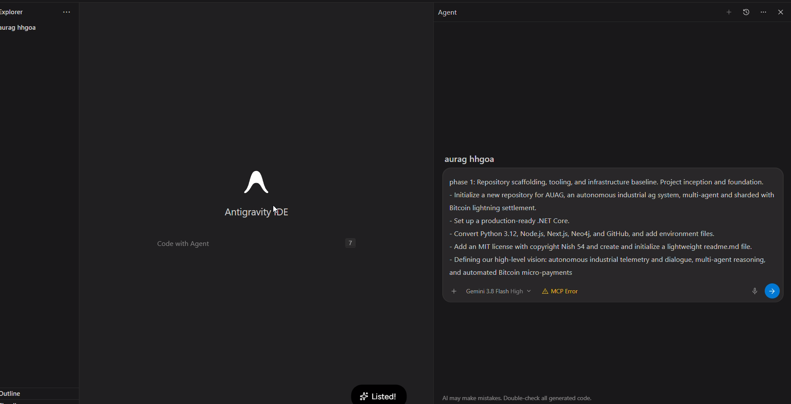

---

### 2. Project Task Architecture & Phase Roadmap
**File**: [`ss2.png`](./ss2.png)  
**Date**: 29 Sep 2026, 2:45 PM  
**Description**: Wispr Flow dictation canvas breaking down the complete project architecture: `todo.md`, `architecture.md`, `project_memory.md`, atomic task schemas, and the 9 sequential execution phases (Setup ➔ UI Scaffold ➔ Voice Input ➔ Intent ➔ Action Execution ➔ Safety ➔ Accessibility ➔ Integration ➔ Release).

  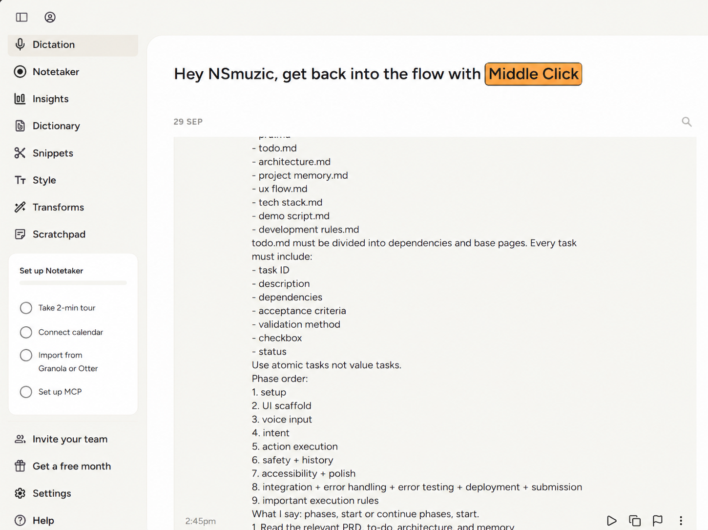

---

### 3. Machine Money Lightning & Settlement Engine
**File**: [`ss3.png`](./ss3.png)  
**Date**: 05 Oct 2026 (Evening Session)  
**Description**: Voice dictation transcript detailing the Bitcoin Lightning settlement architecture: dynamic fee routing, SHA-256 cryptographic preimage proof grounding, Neo4j operational graph recording, and $0.50 (500-sat) per-transaction policy spending caps.

  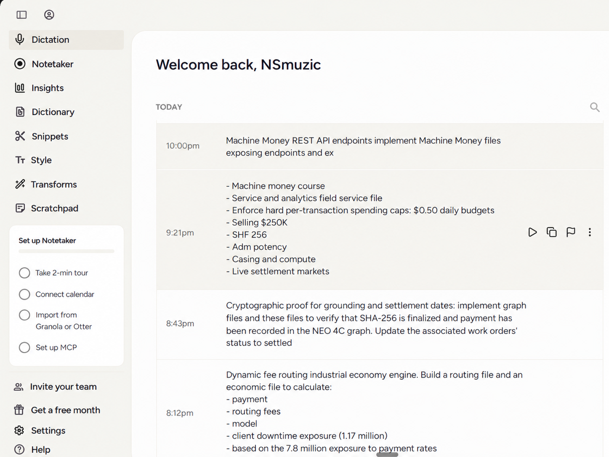

---

### 4. NIP-47 Nostr Wallet Connect (NWC) & BOLT11 Invoices
**File**: [`ss4.png`](./ss4.png)  
**Date**: 04 Oct 2026  
**Description**: Voice prompts specifying BOLT11 invoice parsing without external daemon dependencies, base payment provider abstractions with mock provider fallback, NIP-47 Nostr Wallet Connect transport client, and the certified industrial vendor registry.

  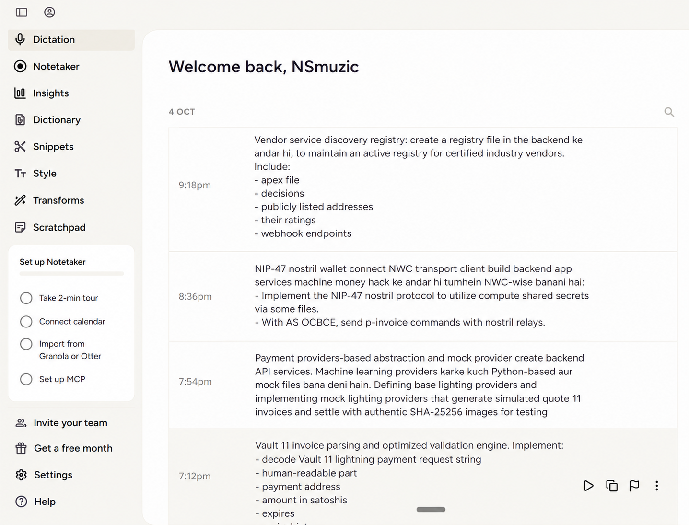

---

### 5. Multi-Agent Swarm, Safety Guardrails & Copilot
**File**: [`ss5.png`](./ss5.png)  
**Date**: 03 Oct 2026  
**Description**: Voice dictation of industrial prompt injection defense guardrails, OSHA/API 610 regulatory compliance agent rules, supervisory multi-agent copilot planning, and unified Model Context Protocol (MCP) gateway configuration.

  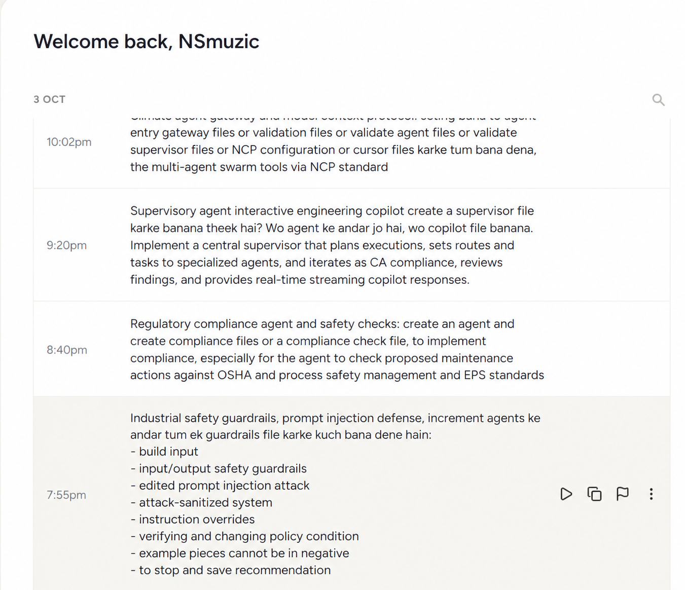

---

### 6. Corpus Indexing & Payment Provider Factory
**File**: [`ss6.png`](./ss6.png)  
**Date**: 04 Oct 2026  
**Description**: Dictation records for real technical corpus indexing, retrieval validation test harness (MRR@5 and Recall@10), payment provider factory pattern, and NWC relay communication pipelines.

  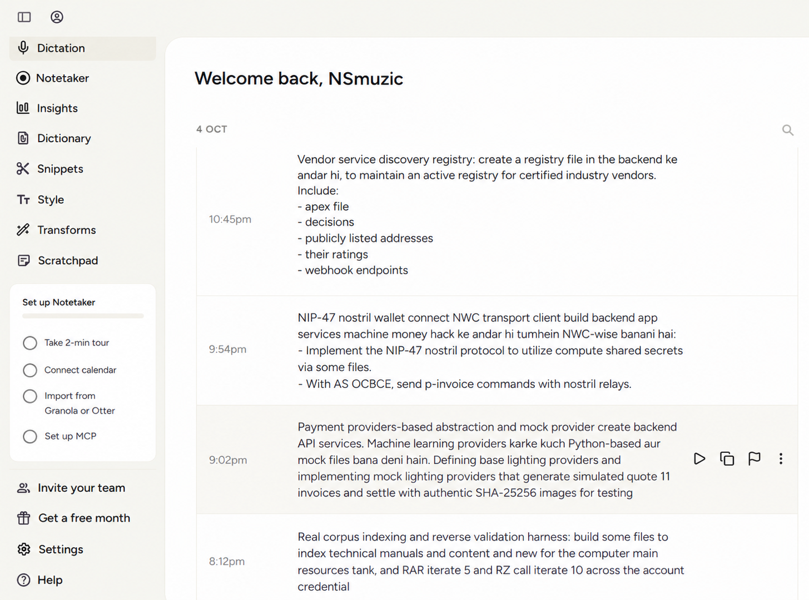

---

### 7. Work Orders, Synthetic Data & Hybrid RAG
**File**: [`ss7.png`](./ss7.png)  
**Date**: 02 Oct 2026  
**Description**: Voice prompting for maintenance work order APIs linked to failure events, synthetic industrial plant schematics and P&ID diagrams, and Phase 5 Hybrid RAG (dense vector + sparse BM25 + Neo4j graph traversal).

  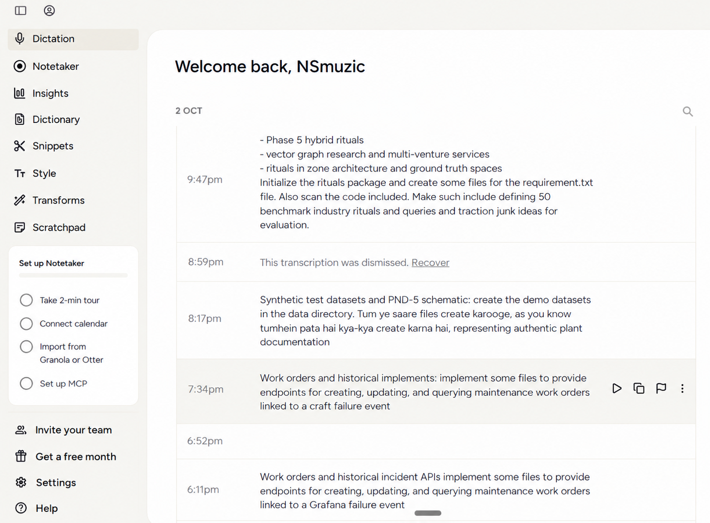

---

### 8. Industrial Telemetry, SCADA & NASA IMS Datasets
**File**: [`ss8.png`](./ss8.png)  
**Date**: 01 Oct 2026  
**Description**: Voice prompts establishing the industrial telemetry streaming architecture: NASA IMS bearing run-to-failure vibration replay fixtures, synthetic SCADA sensor stream generator, and binary OPC-UA industrial protocol adapters.

  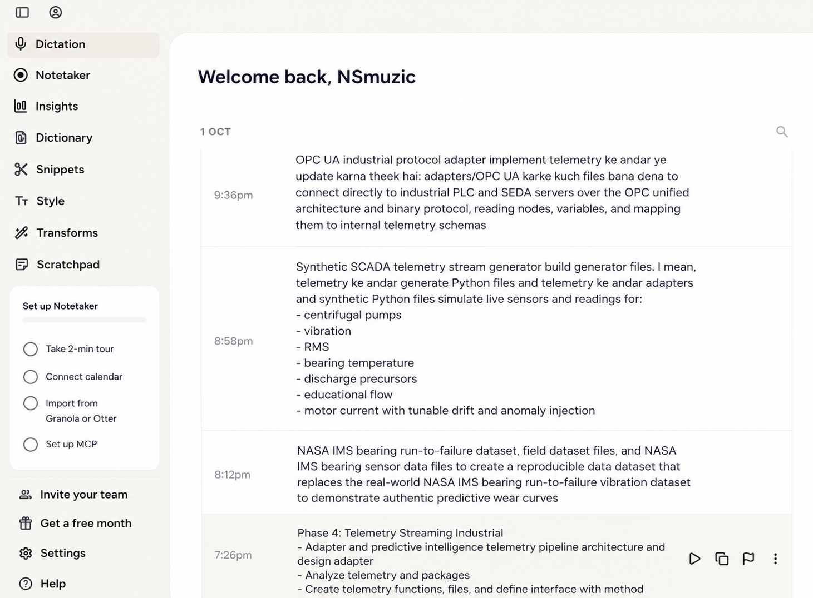

---

### 9, 10 & 11. Ingestion Pipeline, Health APIs & Audit Logging
**Files**: [`ss9.png`](./ss9.png), [`ss10.png`](./ss10.png), [`ss11.png`](./ss11.png)  
**Date**: 01 Oct 2026  
**Description**: Sequential dictation captures detailing Phase 3 industrial document ingestion, multimodal OCR parsers, FastAPI Kubernetes liveness/readiness probes, rule-based automation engine, and SHA-256 cryptographic audit logging.

  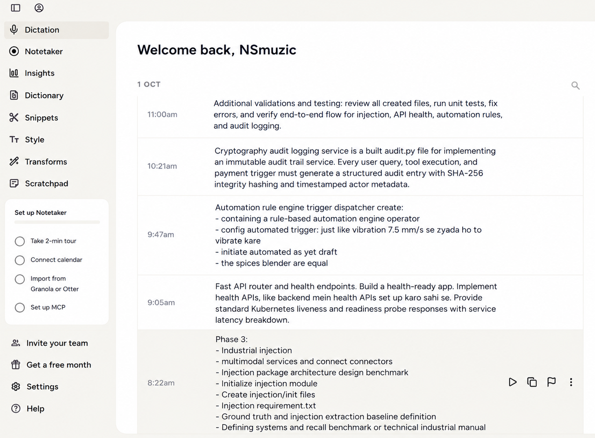

 

  

 

  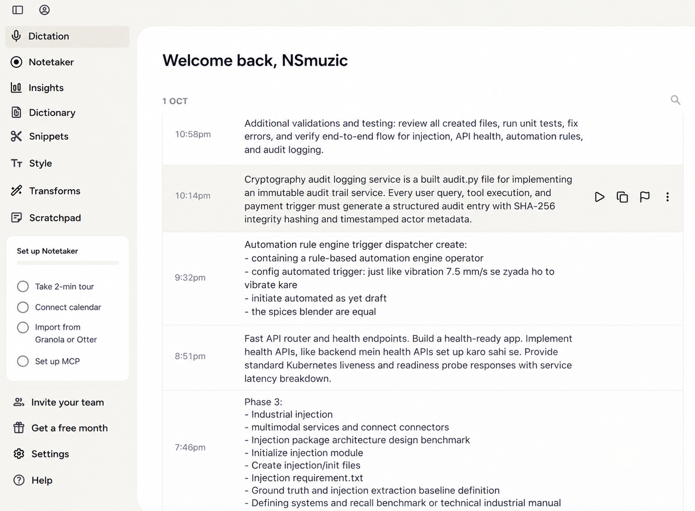

---

### 12. Wispr Flow Activity Dashboard & Session Metrics
**File**: [`ss12.png`](./ss12.png)  
**Date**: 29 Sep 2026  
**Description**: Official Wispr Flow analytics dashboard confirming **3,911 total words**, **87 WPM dictation speed**, and consecutive voice prompt logs for Python dependencies, deterministic lockfile pinning, Docker multi-cloud manifests, and MCP configuration.

  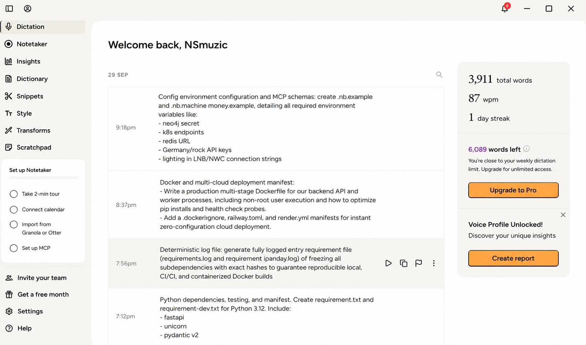

---

## 🔗 Related Resources

* 📜 **[Wispr Flow Evidence Dossier (`WISPR_EVIDENCE.md`)](../WISPR_EVIDENCE.md)**: Exhaustive 9-point proof report, prompt log, mapping table, and testing evidence.
* ⚡ **[Judge Fast-Track Guide (`JUDGE_README.md`)](../JUDGE_README.md)**: 3-minute executive summary and 1-click live demo links.
* 🏛️ **[System Architecture (`ARCHITECTURE.md`)](../ARCHITECTURE.md)**: Canonical system architecture diagrams and technical specifications.
